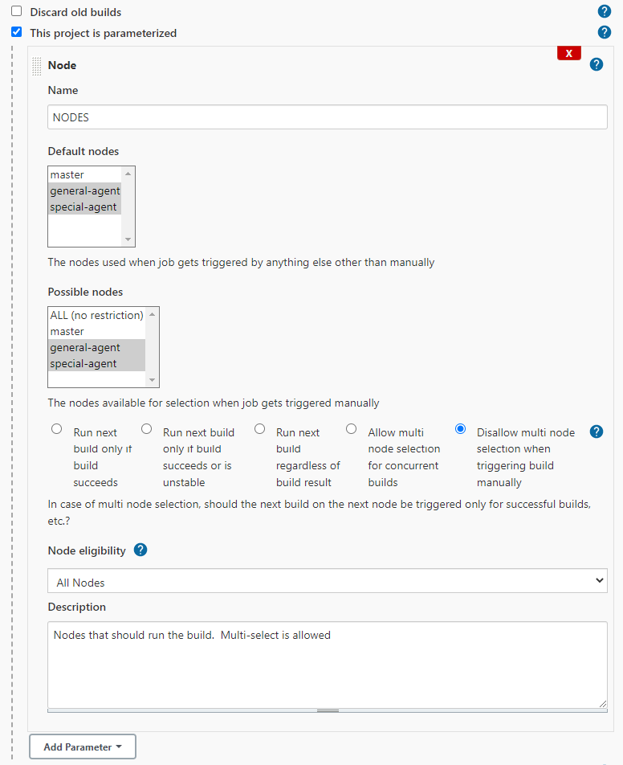
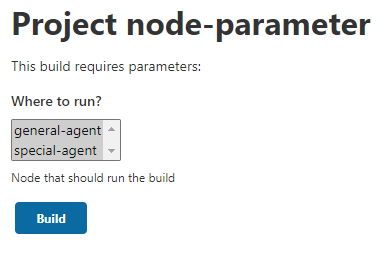
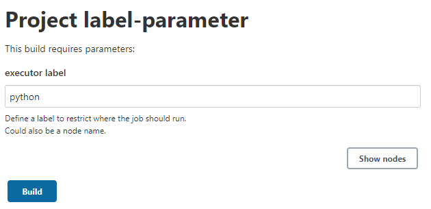
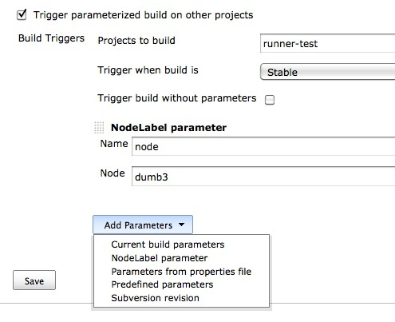
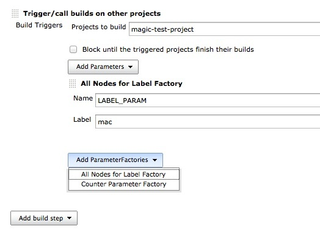

# Node Label Parameter plugin for Jenkins

This plugin adds two new parameter types to job configuration - node and label.
The new parameters allow dynamic selection of the node or label where a job should be executed.

## Description

The plugin can configure additional parameters for a job.
These new parameter types are 'Node' and 'Label'.
This is specially useful if you want to execute the job on different nodes without changing the configuration.
It also allows you to use Jenkins in a scenario where you would like to setup different nodes with the same script/jobs configured - e.g. SW provisioning.
Another usage scenario would be to configure a node maintenance job which you could trigger on request on each node.


Restrict where this project can be run

If you are using a node or label parameter to run your job on a particular node, you should not use the option "Restrict where this project can be run" in the job configuration.
It will not have any effect on agent selection!

## Node Parameter

Define a list of nodes on which the job should be run.
A default node used for scheduled jobs can be defined.
You are able to configure the job to run one after the other or even concurrent.



In case multi node selection was disabled, you get a drop-down to select one node to execute the job.


If multi node selection was enabled, you get the chance to select multiple nodes to run the job.
The job will then be executed on each of the nodes, one after the other or concurrent - depending on the configuration.



## Label Parameter

Define a parameter for the node(s) that will run the job.


Define a label of 'Restrict where this project can be run'.



## Trigger via script

You can also trigger a job via remote call (e.g. script)

Trigger job on multiple nodes:

``` bash
curl --silent -u USER:PASSWORD --show-error \
     --data 'json={"parameter":[{"name":"PARAMNAME","value":["node1","node2"]}]}&Submit=Build' \
     http://localhost:8080/job/remote/build?token=SECTOKEN
```

Although the first format also supports passing just one node name as parameter in the list, the plugin also supports a key/value parameter to trigger the job on a single node only:

``` bash
curl --silent -u USER:PASSWORD --show-error \
     --data 'json={"parameter":[{"name":"PARAMNAME","value":"master"}]}&Submit=Build' \
     http://localhost:8080/job/remote/build?token=SECTOKEN
```

If you have a 'label' parameter (instead of a 'node' parameter), then the request should look like this:

``` bash
curl --silent -u USER:PASSWORD --show-error \
     --data 'json={"parameter":[{"name":"PARAMNAME","label":"mylabel"}]}&Submit=Build' \
     http://localhost:8080/job/remote/build?token=SECTOKEN
```

## Parameterized Trigger Plugin

### Post Build Action

If the [Parameterized Trigger Plugin](https://plugins.jenkins.io/parameterized-trigger/) is installed, an additional parameter is available to pass to the target job.
The parameterized trigger plugin handles Node and Label parameters as every other parameter if you use the option 'Current build parameters'.
But it is not possible to use the 'Predefined parameters' to overwrite such a parameter, therefore the NodeLabel Parameter plugin adds a new parameter to the trigger plugin.

This parameter type defines where the target job should be executed.
The value must match either a label or a node name - otherwise the job will just stay in the queue.
The NodeLabel parameter passed to the target job does not have to exist on the target job (but if the target has one defined, it should match the name).
This way it is possible to trigger jobs on different nodes then they are actually configured.



### BuildParameterFactory

The nodelabel parameter plugin also adds a `BuildParameterFactory` to the parameterized trigger plugin.
This factory enables you to trigger a build of a specific project on all nodes having the same label.

1.  Add the "Trigger/call builds on other projects" build step
2.  Define the project you want to run on each node
3.  Select "All Nodes for Label Factory" from the "Add ParameterFactory" drop-down
4.  Define the label identifying all the nodes that should run the project



Similarly, you can also add "Build on every online node" as a parameter factory.
This will cause the specified projects to run on all nodes (controller and all agents) that are online and have an executor configured.

## Version History - [GitHub Releases](https://github.com/jenkinsci/nodelabelparameter-plugin/releases)

Recent releases are described in [GitHub Releases](https://github.com/jenkinsci/nodelabelparameter-plugin/releases).
The [changelog](CHANGELOG.md) lists the release history through 1.7.3.
